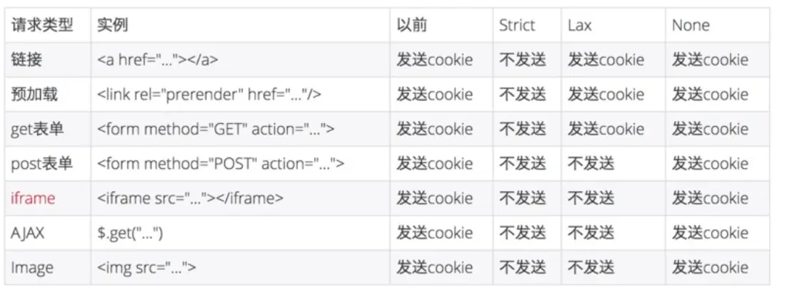

# Cookies

### 1. `Cookie`

  一般来讲，由服务端创建并存储携带在 `http Response Headers` 的 `Set-Cookie` 中，并在浏览器下次请求同一服务器时，通过 `Request Headers` 的 `Cookie` 字段发送给后端。\
`Cookie` 是无状态http&#x7684;_&#x72B6;态_。

`Cookie` 目前主流用法：

* 会话状态管理；
* 个性化设置/推荐（广告投放）；
* 浏览器行为跟踪；

  同时，不仅仅是只有服务端才可创建 `Cookie`，浏览器或者说客户端也可操作 `Cookie`，如：`document.cookie`。

### 2. `Cookie` 生命周期

  `Cookie` 的生命周期可以通过 `Expires` 或 `Max-Age` 来定义。

  有趣的是，经过我的测试发现无论是在前端（浏览器）上直接设置 `Expires/Max-Age` 还是经过 `Node` 服务器进行设置 `Expires/Max-Age` 其最终都会被计算成日期传到前端。

  也就是说，在前端可以看到或者说获取到的 `Cookie` 值其实只有两种，分别是 `Date()` 类型和 `Session` 。

```
🥇 Date() 日期类型
🥈 Session // 仅在当前会话有效
```

  关于 `Cookie` 过期验证，没什么好验证的，过期的 `Cookie` 就直接被浏览器删掉了，根本到不了后端。就算你手动添加一个，那也不是之前那个了，因为那就相当于又重新生效了一个同名 `Cookie` 而已。

### 3. 限制访问 `Cookie`

  有两种方法可以确保 `Cookie` 被安全发送，并且不会被意外的参与者或脚本访问：`Secure` 属性和 `HttpOnly` 属性[\[1\]](broken-reference)。

* `Secure` 只能用在https协议上传输；
* `HttpOnly` 客户端通过 `document.cookie` 无法获取设置该属性的 `Cookie` 字段；

### 4. `Cookie` 作用域

  `Domain` 和 `Path` 标识定义了 `Cookie` 的作用域：即允许 `Cookie` 应该发送给哪些URL[\[1\]](broken-reference)。

* `Domain`：`Cookie` 作用的域名，指定 `Domain` 时，作用的域名为指定域名及其子域名，若未指定，则默认为当前 `origin` 且不包含子域名；
* `Path`：总结为两句话。若设置了，则已设置的值为准，若未设置，则由 `URL` 的 `path` 的最后一个 `/` 向前截取，截取的结果作为 `Cookie` 的 `Path`。其作用域为当前 `path` 路径下的所有子路径，包含当前路径[\[2\]](broken-reference)；

### 5. `SameSite` 属性

  `SameSite` 顾名思义——同一站点的配置项，理解来讲就是来限制 `Cookie` 传播是否受"同一站点—— `SameSite` "的限制。

  `MDN` 里这样描述：`SameSite Cookie` 允许服务器要求某个 `cookie` 在跨站请求时不会被发送，从而可以阻止跨站请求伪造攻击（`CSRF`）[\[1\]](broken-reference)。

`SameSite` 共有下面三种值[\[3\]](broken-reference)[\[4\]](broken-reference)：

* `None`：就是没有限制，`Cookie` 想怎么传就怎么传；
* `Strict`：`Strict`（严格）模式，严格到只有当前 `top.window` 对象的 `url` 及其子 `url` 才有资格传播，但不代表一定会传播，因为还要满足 [`Cookie` 作用域](broken-reference) 的限制；
* `Lax`：`Lax`（不严格）模式，即存在一些情况可以传播 `Cookie`；

具体情况见下图描述⬇️。[\[5\]](broken-reference)

<figure><figcaption></figcaption></figure>

### 6. `Cookie prefixes`

  `Cookie prefixes` 指在 `Cookie` 名前添加绑定的前缀：`"__Host-"` 与 `"__Secure-"`。

* `__Host-`：`MDN` 这么解释道：它需要设置 `Secure` 属性，并且来自安全的 `origin`，同时还要设置 `Path` 为 `/`，但 `Domain` 要为默认值，即只有在当前安全的 `host` 下才可传播发送该 `Cookie`, 同时 `MDN` 称之为 `domain-locked`, 我理解其为`"被锁定的域"`。
* `__Secure-`：相较于 `__Host-`，其仅要求来自安全的 `origin`，并设置 `Secure` 属性才可传播发送。

### 7. `JavaScript` 通过 `Document.cookie` 访问 `Cookie`

  在[第一章节](broken-reference)中就已经剪短提到过通过 `JavaScript` 对 `Cookie` 进行操作的方法，但该方法仅可访问创建非 `HttpOnly` 标记的 `Cookie`。

### 8. [`Cookie` 安全](https://developer.mozilla.org/zh-CN/docs/Web/HTTP/Cookies#%E5%AE%89%E5%85%A8)

  凡事涉及安全的问题都不会是小问题。

  这里不太好概述，理解的也不深，直接贴链接吧

> 参考资料:
>
> \[1]. [HTTP cookies of MDN](https://developer.mozilla.org/zh-CN/docs/Web/HTTP/Cookies)
>
> \[2]. [Cookie的path值的默认规则](https://www.jianshu.com/p/48556e5c44f5)
>
> \[3]. [Cookie SameSite](https://www.youtube.com/watch?v=aUF2QCEudPo)
>
> \[4]. [SameSite 是什么](https://www.leixue.com/ask/what-is-samesite)
>
> \[5]. [Cookie中的SameSite设置](https://www.jianshu.com/p/dd73c27ab8d6)
>
> \[6]. [Cookie 安全 of MDN](https://developer.mozilla.org/zh-CN/docs/Web/HTTP/Cookies#%E5%AE%89%E5%85%A8)
>
> \[7]. [Markdown syntax](http://www.markdown.cn/)
