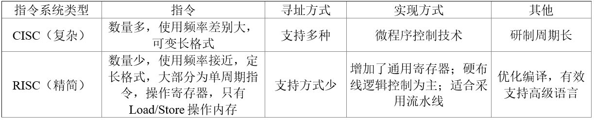

# 计算机系统基础

### 1. 输入/输出技术的三种方式：

以下关于中断方式与DMA方式的叙述中，正确的是（  ）。

* [x] A.中断方式与DMA方式都可实现外设与CPU之间的并行工作&#x20;
* [ ] B.程序中断方式和DMA方式在数据传输过程中都不需要CPU的干预&#x20;
* [ ] C.采用DMA方式传输数据的速度比程序中断方式的速度慢&#x20;
* [ ] D.程序中断方式和DMA方式都不需要CPU保护现场&#x20;

> * 直接查询控制：有`无条件传送`和`程序查询`方式，都需要通过CPU执行程序来查询外设的状态，判断外设是否准备好接收数据或准备好了向CPU输入的数据。在这种情况下CPU不做别的事情，只是不停地对外设的状态进行查询。
> * 中断方式：当I/O系统与外设交换数据时，CPU无须等待也不必查询I/O的状态，而可以抽身来处理其他任务。当I/O系统准备好以后，则发出中断请求信号通知CPU，CPU接到中断请求信号后，保存正在执行的程序的现场，转入I/O中断服务程序的执行，完成与I/O系统的数据交换，然后再返回被打断的程序继续执行。与程序控制方式相比，中断方式因为CPU无需等待而提高了效率。
> * DMA：`直接寄存器存取`方式，是指数据在内存与I/O设备间的直接成块传送，即在内存与I/O设备间传送一个数据块的过程中，不需要CPU的任何干涉，只需要CPU在过程开始启动与过程结束时的处理，实际操作由DMA硬件直接执行完成。

### 2. 死锁资源计算数

某系统中有6个并发进程竞争资源R。假设每个进程都需要3个R，那么最少需要有(  )个R，才能保证系统不会发生死锁。

* [ ] A. 12&#x20;
* [x] B. 13
* [ ] C. 15&#x20;
* [ ] D. 16&#x20;

> 系统不会发生死锁的条件是：系统资源总数≥进程数\*（每个进程所需资源数-1）+1。

### 3. 线程相关概念

在支持多线程的操作系统中，假设进程P1创建了线程T1和T2，进程P2创建了线程T3和T4，那么以下说法错误的是（  ）。

* [ ] A. 线程T1和T2可以共享P1的数据段&#x20;
* [ ] B. 线程T3和T4可以共享P2的数据段&#x20;
* [ ] C. 线程T1和T2可以共享P1中任何一个线程打开的文件&#x20;
* [x] D. 线程T3可以共享线程T4的栈指针

> 在同一进程中的各个线程都可以共享该进程所拥有的资源，如访问进程地址空间中的每一个虚地址；访问进程所拥有的已打开文件、定时器、信号量等，但是不能共享进程中某线程的栈指针。
>
> 

### 4. 位示图

某计算机字长32位，磁盘空间管理采用Bitmap，磁盘容量为300G， 物理块大小是4MB，位示图大小是（  ）个字。

* [x] A. 2400
* [ ] B. 3200
* [ ] C. 6400&#x20;
* [ ] D. 9600

> `位示图`是利用二进制的一位来表示磁盘中的一个盘块的使用情况
>
> _`位示图的大小=磁盘块数量/字长多少位`_

### 5. 性能评价方法

常见的性能评价方法包括：

* 时钟频率法：以时钟频率高低衡量速度。&#x20;
* 指令执行速度法：表示机器运算速度的单位是MIPS。 等效指令速度法 （ Gibson mix，吉普森混合法）：通过各类指令在程序中所占的比例（Wi）进行计算得到的。特点：考虑指令比例不同的问题。&#x20;
* 数据处理速率法（PDR ，Processing Data Rate ）：PDR值的方法来衡量机器性能，PDR值越大，机器性能越好。PDR = L/R 特点：考虑CPU+存储
* 综合理论性能法（CTP ，Composite Theoretical Performance ）：CTP用MTOPS（Million Theoretical Operations Per Second，每秒百万次理论运算）表示。CTP的估算方法是，首先算出处理部件每个计算单元的有效计算率，再按不同字长加以调整，得出该计算单元的理论性能，所有组成该处理部件的计算单元的理论性能之和即为CTP。&#x20;
* 基准程序法：把应用程序中用得最多、最频繁的那部分核心程序作为评估计算机系统性能的标准程序，称为基准测试程序（benchmark）。

基准程序法是目前一致承认的测试系统性能的较好方法。 基准程序法由于考虑了软硬件多方面的因素，所以准确度是各种评价方法中最精准的。

### 6. Cache

以下关于Cache的叙述中，正确的是（  ）。

* [ ] A. 在容量确定的情况下，替换算法的时间复杂度是影响Cache命中率的关键因素&#x20;
* [x] B. Cache的设计思想是在合理的成本下提高命中率
* [ ] C. Cache的设计目标是容量尽可能与主存容量相等
* [ ] D. CPU中的Cache容量应大于CPU之外的Cache容量

> Cache是介于CPU与内存之间的一种高速缓存。这种存储器速度比内存快了很多倍，利用到局部性原理，只需要少量的Cache，便能使整个机器访问内存数据得到极大的提升。所以Cache是一种应用非常普遍的技术，Cache在实际应用中，可以分多级，如1级Cache，2级Cache。1级Cache往往位于CPU中，其容量比在主板上的2级Cache小，但速度比2级Cache快。 影响Cache命中率的因素包括高速存储器的容量、存储单元组的大小、组数多少、地址联想比较方法、替换算法、写操作处理方法和程序特性等，这些因素相互影响，没有关键影响因素。而A选项错误的原因是：在容量确定的情况下，替换算法是影响Cache命中率的关键因素，而不是时间复杂度，可以理解为，时间复杂度只会影响命中的速度，并不能影响最终是否命中。

### 7. CISC与RISC

以下关于CISC（Complex Instruction Set Computer，复杂指令集计算机）和RISC（Reduced Instruction Set Computer，精简指令集计算机）的叙述中，错误的是（ ）。

* [x] A. 在CISC中，复杂指令都采用硬布线逻辑来执行
* [ ] B. 一般而言，采用CISC技术的CPU，其芯片设计复杂度更高
* [ ] C. 在RISC中，更适合采用硬布线逻辑执行指令
* [ ] D. 采用RISC技术，指令系统中的指令种类和寻址方式更少

> 

### 其他

* 【测试精确度排名】 真实的程序 > 基准程序【核心程序】 > 小型基准程序 > 合成基准程序
* 测试相关
  1. 性能评估是为了一个目的，按照一定的步骤，选用一定的度量项目，通过建模和实验，对一个系统的性能进行各项检测，对测试结果作出解释，并形成一份文档的技术。 性能评估的一个目的是为性能的优化提供参考。
  2. 在Web服务器的测试中，反映其性能的指标主要有：最大并发连接数、响应延迟、连接速度和吞吐量等。常见的Web服务器性能评测方法有基准性能测试、压力测试和可靠性测试。
